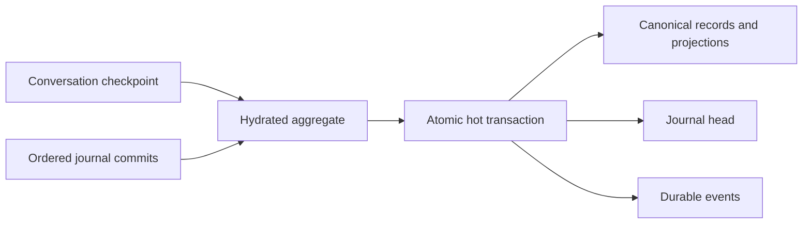

# Storage architecture

> **Status:** Current implementation. Owning paths, schemas, repositories, and tests remain authoritative.

Nerve separates portable configuration, secrets, canonical application data, user-authored agent resources, and disposable state. `ZEROLEAK_HOME` defaults to `~/.zeroleak`; tests and diagnostics must use an isolated home under `/tmp` rather than the live home.

## Home boundaries

The path inventory is owned by [`storage-bootstrap/paths.ts`](../../packages/workbench-server/src/infrastructure/storage-bootstrap/paths.ts).

```text
<ZEROLEAK_HOME>/
├── manifest.json
├── daemon.json
├── config/
│   ├── daemon.json
│   ├── harness.json
│   ├── ui.json
│   ├── permissions.json
│   ├── providers.json
│   └── integrations.json
├── secrets/
│   ├── master.key
│   ├── credentials.enc
│   └── daemon-token
├── data/
│   ├── nerve.sqlite
│   ├── conversations/
│   ├── tasks/
│   ├── reports/
│   ├── images/
│   └── plans/
├── agent/
├── tls/
├── tmp/
├── cache/
├── logs/
├── crashes/
├── migrations/
└── backups/
```

`manifest.json` identifies the current `nerve-home` format version `1`. Optional directories are created lazily. Electron's `userData` profile is outside `ZEROLEAK_HOME` and must be isolated separately in desktop tests that require full browser-state isolation.

### Ownership

- `config/` contains versioned, human-readable portable settings. Writers validate and atomically replace these files.
- `secrets/` contains the restricted master key, encrypted credentials, and daemon token. Plaintext secret values do not belong in configuration or SQLite.
- `data/nerve.sqlite` is authoritative for relational, historical, transactional, and internal state.
- `data/conversations/` contains owner-scoped complete tool-result payloads and managed tool-call files.
- `data/tasks/` contains append-heavy task output bundles; task identity and lifecycle metadata remain in SQLite.
- `data/reports/`, `data/images/`, and `data/plans/` hold durable files authored or imported for those explicit categories.
- `agent/` contains user-authored harness resources such as instructions, skills, and suggestions.
- `cache/` and `tmp/` are rebuildable or disposable. Logs, crash reports, migrations, and backups have separate retention and cleanup rules.

Persisted records use logical home-relative references. Runtime code resolves those references against the active `ZEROLEAK_HOME`, so moving a complete home does not preserve obsolete absolute paths.

## Canonical SQLite

The physical schema is owned by [`canonical-sqlite/schema.ts`](../../packages/workbench-server/src/infrastructure/persistence/canonical-sqlite/schema.ts). Its main tables are:

| Table                                              | Role                                                                                |
| -------------------------------------------------- | ----------------------------------------------------------------------------------- |
| `schema_migrations`                                | Canonical schema baseline and migration identity.                                   |
| `conversation_records`                             | Ordered, versioned messages, summaries, runs, tool calls, and tool batches.         |
| `conversation_record_projections`                  | Query projections for message, summary, and run records.                            |
| `tool_call_projections`                            | Queryable tool-call status, interaction, and ownership fields.                      |
| `agent_context_leaves`                             | Active branch leaf for each conversation agent.                                     |
| `durable_event_stream_counters` / `durable_events` | Ordered reliable notification streams; events are not canonical conversation state. |
| `file_assets`                                      | Logical path, owner, category, size, digest, and media metadata for managed files.  |
| `rpc_idempotency`                                  | Bounded RPC outcomes for safe retries.                                              |
| `domain_documents`                                 | Versioned domain records that do not require dedicated relational tables.           |

Projects, conversations, agents, settings, tasks, and other domain state use repositories backed by `domain_documents` where a dedicated query table is unnecessary. The older conceptual `PROJECT`/`CONVERSATION`/`AGENT` ERD is therefore not the physical database model.

## Conversation journal

A conversation is hydrated from a checkpoint plus ordered journal commits:

- `conversation_state` documents are full checkpoints used for cold hydration, import, and repair.
- `conversation_journal_head` documents hold the current revision and checksum for compare-and-swap.
- `conversation_journal_commit` documents hold validated revision-keyed deltas.
- A hot transaction appends the delta, advances the head, updates affected records and context leaves, and appends its durable notification atomically.
- Graceful checkpointing folds loaded deltas into a new checkpoint and deletes only covered commits. Interrupted checkpointing leaves retained commits available for recovery.

These names are `domain_documents` namespaces, not standalone SQL tables. Hot commits must remain proportional to the current change and affected records rather than unrelated conversation history.



## Complete tool results and task output

Tool execution has separate complete-result, agent-projection, and transcript-preview concerns. When the complete result needs externalization, the server prepares and validates an owner-scoped payload beneath `data/conversations/`, records its logical reference and integrity metadata, and only then exposes bounded projections. See [Tool-result projection](../decisions/tool-result-projection.md).

Task output is byte-faithful and append-heavy, so bundles live beneath `data/tasks/<task-id>/`. SQLite remains authoritative for task definitions, execution state, and ownership.

## Migration boundary

Ordinary startup fails closed for malformed, unknown, or future homes. The one legacy import path accepts only the released `nerve-workbench-state` version `2` layout with its checksummed ledger through `0012-remove-workers`. It migrates directly into a staged `nerve-home` v1 and canonical schema-v1 baseline, validates the result, atomically promotes it, and retains the original tree under `backups/`.

Development-only intermediate homes are not accepted. Logs, caches, task runtime state, daemon metadata, TLS identity, and generated diagnostics are regenerated rather than imported. The implementation is owned by [`infrastructure/migrations/`](../../packages/workbench-server/src/infrastructure/migrations/) and storage-bootstrap tests.

## Public guidance

- [Storage, cleanup, and migration](https://nerve.tlmtech.dev/operations/storage-migration/)
- [Data formats and locations](https://nerve.tlmtech.dev/reference/data-formats/)
- [Persistence and security boundaries](https://nerve.tlmtech.dev/developers/persistence-security/)
