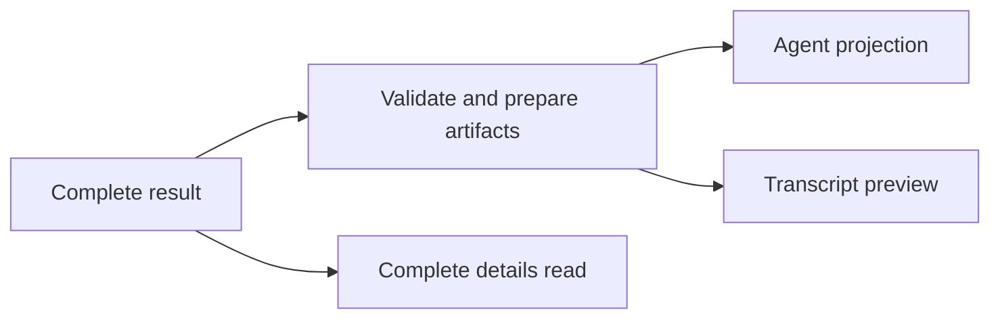

# Tool-result projection

> **Status:** Accepted and implemented. Contracts, catalog policy, implementation, and focused tests are authoritative for current profiles and limits.

## Decision

A tool call has three distinct result forms:

1. the complete durable result or managed file artifact;
2. the bounded projection returned to the agent model;
3. the compact public transcript preview shown in the UI.

These forms have different consumers and must not share one accidental limit. Complete data preserves recovery, agent projections preserve useful context, and transcript previews preserve a safe, readable workbench history.

## Rationale and invariants

- **Semantic selection precedes bounding.** A projector selects the useful representation before applying line, byte, or item limits; it does not serialize every duplicate field and truncate the aggregate.
- **Small results stay intact.** If the canonical agent candidate fits its profile, it is returned unchanged. Artifact presence alone does not force a path-only response.
- **Every call has an independent budget.** Parallel and batched siblings do not compete for one allowance. Delegated Explore reports are independently bounded per requested report.
- **Recovery is exact.** Truncation retains a continuation mechanism or a verified, agent-readable complete payload/artifact path. Externalization completes before a truncated projection is exposed.
- **Status and continuation outrank bulk output.** Failures, warnings, exit state, affected resources, cursors, omitted counts, and next actions remain visible.
- **Artifact trust is explicit.** Host code validates ownership, logical paths, availability, readability, and integrity before an artifact can become a recovery source.
- **Unknown tools fail conservatively.** Historical or newly encountered names use the fallback projection policy and never fabricate recovery for bytes that were not preserved.
- **Projection never weakens the complete result.** Changing model-facing output does not mutate or delete canonical data.

When a useful result overflows and an available readable artifact becomes authoritative, the projection becomes a compact status, summary, size/count, path, and inspection guide rather than a large excerpt that the agent must reread. Without such an artifact, the normal bounded inline strategy remains and must include exact continuation or a readable complete-result payload.

## Ownership

- Projection contracts and profile identifiers: [`packages/contracts/src/domains/tools/tool-agent-projection.ts`](../../packages/contracts/src/domains/tools/tool-agent-projection.ts)
- Tool policies, profiles, and projection strategies: [`packages/tools/src/result-projection/`](../../packages/tools/src/result-projection/)
- Host artifact validation, preparation, payload storage, and projection: [`packages/workbench-server/src/domains/tools/artifacts/`](../../packages/workbench-server/src/domains/tools/artifacts/)
- Projection tests: [`packages/tools/test/result-projection/result-projection.test.ts`](../../packages/tools/test/result-projection/result-projection.test.ts)
- Host trust tests: [`packages/workbench-server/test/domains/tools/tool-result-artifact-validator.test.ts`](../../packages/workbench-server/test/domains/tools/tool-result-artifact-validator.test.ts)

Do not copy the profile inventory, exact budgets, or tool count into this decision record. Those values evolve with the owning catalog and contracts.

## Public guidance

See [Tool output lifecycle](https://nerve.tlmtech.dev/developers/tool-output-lifecycle/) for the current developer-facing behavior.
