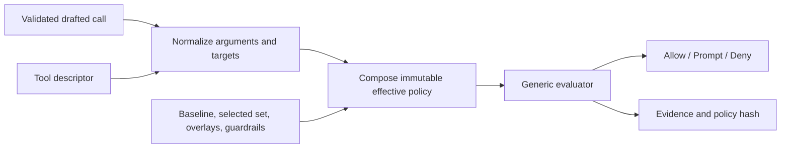

# Permission rules and rule sets

> **Status:** Active target proposal; not implemented. Current behavior is defined by the permission contracts, tool policy implementation, tests, and the public [Tools and approval policy](https://nerve.tlmtech.dev/developers/tools-policy/) page.

## Current versus target

The shipped evaluator currently combines:

- permission levels `autonomous`, `supervised`, and `read_only`;
- catalog and argument-sensitive risk assessment;
- normalized request targets and host/mode constraints;
- user and project `allow`/`deny` exceptions;
- outcomes `allow`, `approval`, or `deny`.

Current implementation is owned by [`permissions.ts`](../../packages/contracts/src/domains/permissions/permissions.ts), [`evaluate-tool-permission.ts`](../../packages/tools/src/policy/evaluate-tool-permission.ts), and [`evaluate-tool-supervision.ts`](../../packages/tools/src/policy/evaluate-tool-supervision.ts).

This proposal would replace mode-specific baselines and exception composition with named, versioned rule sets and scoped overlays. In the target terminology, the outcomes are `allow`, `prompt`, or `deny`; target `prompt` corresponds to the current evaluator's `approval` boundary. The proposal must not be read as shipped behavior.

## Purpose

Use one generic permission framework for every agent-callable tool. The framework decides whether a validated drafted call may execute automatically, requires a user decision, or must not execute.

Product concepts such as Read only, Supervised, Autonomous, Planning, and future custom agents select or compose rule sets. They do not add special branches inside the generic evaluator.

The target system must be:

- deterministic and fail-closed;
- independent of tool execution and agent mode implementation;
- argument- and target-aware;
- explainable from a durable policy snapshot;
- configurable at user, project, and conversation scopes;
- portable across machines and `ZEROLEAK_HOME` locations;
- extensible without copying the tool catalog into policy prose.

## Concepts

| Concept             | Target meaning                                                                                                                                                |
| ------------------- | ------------------------------------------------------------------------------------------------------------------------------------------------------------- |
| Permission rule     | Filters plus one `allow`, `prompt`, or `deny` decision.                                                                                                       |
| Permission rule set | Named, versioned, ordered collection of permission rules with source and compatibility metadata.                                                              |
| Built-in rule set   | Immutable application-owned Baseline, Read only, Supervised, Autonomous, or Planning policy.                                                                  |
| Overlay             | Scoped ad hoc rules applied above the selected set. User and project overlays are portable configuration; conversation overlays are conversation-owned state. |
| Guardrail           | Non-overridable restriction that can only preserve or reduce authority.                                                                                       |
| Effective policy    | Immutable composition evaluated for one drafted call.                                                                                                         |
| Tool descriptor     | Catalog-owned identity, groups, risks, argument selectors, and target extraction metadata.                                                                    |
| Permission target   | Canonical structured resource affected by the call, such as a path, command segment, URL, agent, or whole tool.                                               |

The tool manifest remains the source of truth for available names and metadata. This proposal intentionally does not duplicate the catalog.

## Evaluation model



### Preconditions

Before matching rules, the host must:

1. validate arguments against the active tool schema;
2. canonicalize paths, URLs, commands, and identifiers;
3. derive every required security target;
4. reject malformed requests or target-extraction failures;
5. snapshot the applicable rule sources and tool metadata.

Normalization is a security boundary. Rules never match untrusted raw argument text when a canonical form is available.

### Composition order

The target effective policy composes:

1. non-overridable Baseline guardrails;
2. one selected built-in or custom rule set;
3. user overlay;
4. project overlay;
5. conversation overlay;
6. call-specific host constraints that can only reduce authority.

Exact precedence is encoded in contracts, not inferred from storage order. Deny/guardrail behavior must remain monotonic: a lower-authority layer cannot override a non-overridable restriction.

### Matching

Rules may filter by stable catalog metadata and normalized request data, including:

- exact tool name or catalog-owned group;
- base/effective risk;
- normalized target kind and access;
- project-relative path glob;
- command token/prefix pattern;
- canonical URL origin or host pattern;
- primary validated argument;
- agent type or selected policy purpose where explicitly modeled.

Multi-target calls are allowed automatically only when the effective decision covers every relevant target. Whole-tool authority is used when no narrower structured target represents the call's complete effects.

### Decision and evidence

Every successful evaluation returns exactly one target decision:

```ts
type PermissionDecision = "allow" | "prompt" | "deny";
```

The durable evidence should include the policy version/hash, normalized targets, applicable rule source versions, matched rule identifiers, reason, and any safe suggested overlay. Evidence is committed before execution starts so a later policy edit cannot change why an existing call proceeded or stopped.

Interaction tools that implement the human boundary must not recursively prompt for permission to display that boundary.

## Storage and portability

- Built-in rule sets ship with the application and are immutable.
- User and project rule sets/overlays use versioned portable configuration without absolute `ZEROLEAK_HOME` paths.
- Conversation overlays are canonical conversation-owned data.
- Durable records store policy identity and evidence, not a mutable pointer whose meaning can change later.
- Secrets never appear in rules or evidence.
- Unknown tool names remain readable in historical evidence but cannot execute without an active catalog descriptor.

The final storage shape must follow the implemented [storage architecture](../architecture/storage.md); this proposal does not reserve new directories or tables.

## Failure behavior

The target evaluator denies when:

- arguments fail validation;
- required targets cannot be derived or canonicalized;
- a referenced rule set is missing, malformed, incompatible, or has an unknown version;
- the selected policy exceeds an enclosing guardrail;
- an unknown matcher could expand authority;
- policy evidence cannot be committed before execution.

A policy failure is never converted into automatic approval.

## Implementation criteria

The proposal is complete only when:

- shared contracts define rule sets, overlays, normalized requests, decisions, and evidence;
- the tool manifest supplies all required metadata without a second inventory;
- one pure evaluator covers built-in modes and custom policies;
- server composition resolves scoped sources and commits evidence atomically with lifecycle transitions;
- migration preserves current exceptions or requires an explicit, understandable reset;
- UI surfaces selection, explanation, and editing without bypassing guardrails;
- focused tests cover precedence, every-target coverage, portability, malformed sources, unknown tools, restart restoration, and current-policy migration;
- public docs are updated from current exception behavior only after the cutover ships.

## Non-goals

- Operating-system sandboxing or container isolation.
- Inferring arbitrary shell/Python safety from source text.
- Storing complete tool metadata in policy files.
- Allowing overlays to bypass hard host, planning, or secret boundaries.
- Maintaining parallel legacy and rule-set evaluators after migration.
