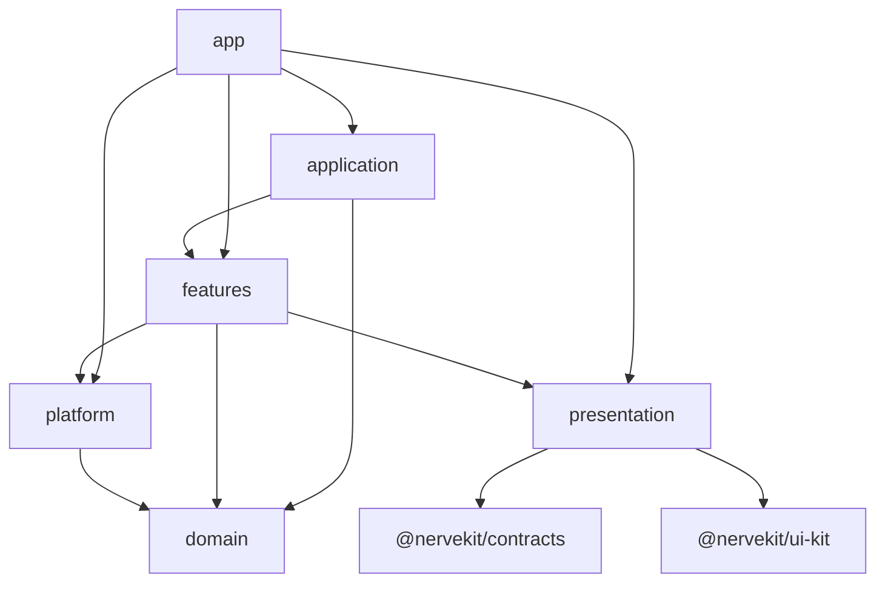

# Workbench module ownership

The frontend combines a composition root, cross-feature workflows, pure product concepts, vertical features, concrete platform adapters, and stateless shared presentation. The import graph is enforced by `scripts/lib/workbench-boundaries.mjs`.

## Directories

- `app/`: executable composition, providers, shell, onboarding, and concrete registrations. `composition/registries` owns lazy center/panel descriptors, `composition/hosts` renders descriptors generically, and `composition/panels` owns each panel's feature wiring.
- `application/`: startup, workspace, commands, notifications, event routing, and other cross-feature workflows. Workspace coordination consumes one application-owned registry of readonly feature projections and named commands. Concrete feature implementations and reverse selector inputs are installed only by `app/composition/registrations` and explicitly unregistered on provider disposal.
- `domain/`: pure conversations, filesystem, navigation, permissions, and project concepts. It may depend only on itself and external contract packages.
- `features/<feature>/`: vertical product capabilities. Large slices use `api`, `model`, `state`, `views`, `hosts`, and translation-only `adapters`; small slices stay flat. A feature never imports another feature.
- `platform/`: browser/Electron infrastructure, including the same-origin HTTP client, query, logging, crypto, PWA, desktop, and clipboard adapters.
- `presentation/`: cross-feature stateless UI grouped by visible concept (`panels`, `composer`, `transcript`, `settings`, `tools`, and so on). It cannot import app state or platform code.
- `api.ts`: external package surface, not an internal service locator.

## Naming

- `*Host` owns state/effects for one registered surface; `*View` renders props/callbacks; `*Panel` is dock content; `*Pane` is a bounded region.
- `*Shell` is reserved for generic/global layout. `*Adapter` translates across a boundary.
- Feature public `index.ts` files expose curated feature behavior and views—not mutable stores or workspace adapters as shortcuts. Cross-feature workspace reads and writes go through `workspace-feature-ports.svelte.ts`.
- Tests stay beside the policy, projection, state coordinator, or component they validate.

Persisted center-tab IDs, panel IDs, and storage keys are compatibility-sensitive and do not follow source-file renames.
